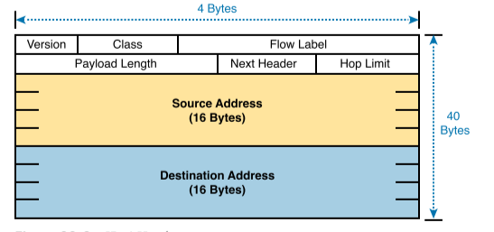

# Fundamentals of IPv6
## Introduction to IPv6
IPv4 address exhaustion problem : The IETF came up with several short-term solutions to make IPv4 addresses last longer, and one long-term solution: IPv6. However, several other tools like Network Address Translation (NAT) and classless interdomain routing (CIDR) helped extend IPv4’s life another couple of decades.

### The IPv6 Protocols
- Older OSPF Version 2 Upgraded to <b>OSPF Version 3</b>: The older Open Shortest Path First (OSPF) version 2 works for IPv4, but not for IPv6, so a newer version, OSPF version 3, was created to support IPv6. (Note: OSPFv3 was later upgraded to support advertising both IPv4 and IPv6 routes.) 
- ICMP Upgraded to <b>ICMP Version 6</b>: Internet Control Message Protocol (ICMP) worked well with IPv4 but needed to be changed to support IPv6. The new name is ICMPv6. 
- ARP Replaced by <b>Neighbor Discovery Protocol</b>: For IPv4, Address Resolution Protocol (ARP) discovers the MAC address used by neighbors. IPv6 replaces ARP with a more general Neighbor Discovery Protocol (NDP).

IPv6 defines a shorter hexadecimal format, requiring at most 32 hexadecimal digits instead of 132 bits. 

IPv6 defines a header, with places to hold both the source and destination address fields. Compared to IPv4, the IPv6 header does make some other changes besides simply making the address fields larger. However, even though the IPv6 header is larger than an IPv4 header, the IPv6 header is actually simpler (on purpose), to reduce the work done each time a router must route an IPv6 packet. 

When a router de-encapsulates the packet from the data-link frame, it must also decide what type of packet sits inside the frame. To do so, the router must look at a protocol type field in the data-link header, which identifies the type of packet inside the data-link frame. 

In most enterprise networks, the routers will route both IPv4 and IPv6 packets at the same time. IPv6 allows for a slow migration, during which some or all routers forward both IPv4 and IPv6 packets. (The migration strategy of running both IPv4 and IPv6 is called dual stack.) 

### IPv6 Routing Protocols
- RIPng (RIP next generation)
- OSPFv3 (OSPF version 3)
- EIGRPv6 (EIGRP for IPv6)
- MP BGP-4 (Multiprotocol BGP version 4)

## IPv6 Addressing Formats and Conventions

#### Abbreviating IPv6 Addresses
- remove the leading 0s
- string of two or more consecutive quartets of all hex 0s, and replace that set of quartets with a double colon (::). However, you can use :: only once in a single address 