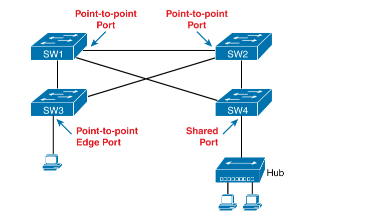

# Spanning Tree Protocol Concepts
## STP and RSTP Basics 
If the port is in STP/RSTP forwarding state in that VLAN, use it as normal; if it is in STP/RSTP blocking state, however, block all user traffic and do not send or receive user traffic on that interface in that VLAN.
STP/RSTP states do not change the other information you already know about switch interfaces. The interface’s state of connected/notconnect does not change. The interface’s operational state as either an access or trunk port does not change. STP/RSTP adds this additional state, with the blocking state basically disabling the interface.
 <code>broadcast storm</code>
Problems Caused by Not Using STP in Redundant LANs:
- <b>Broadcast storms</b> : The forwarding of a frame repeatedly on the same links, consuming significant parts of the links’ capacities
- <b>MAC table instability</b> : The continual updating of a switch’s MAC address table with incorrect entries, in reaction to looping frames, resulting in frames being sent to the wrong locations
- <b>Multiple frame transmission</b> : A side effect of looping frames in which multiple copies of one frame are delivered to the intended host, confusing the host

STP/RSTP prevents loops by placing each switch port in either a forwarding state or a blocking state.

STP/RSTP uses three criteria to choose whether to put an interface in forwarding state: 
- STP/RSTP elects a root switch. STP puts all working interfaces on the root switch in forwarding state.
- Each nonroot switch considers one of its ports to have the least administrative cost between itself and the root switch. The cost is called that switch’s root cost. STP/RSTP places its port that is part of the least root cost path, called that switch’s root port (RP), in forwarding state.
- With two switches on a link, the switch with the lowest root cost, as compared with the other switches attached to the same link, is placed in forwarding state. That switch is the designated switch, and that switch’s interface, attached to that segment, is called the designated port (DP).

### STP Bridge ID and Hello BPDU
STP/RSTP bridge ID (BID) is an 8-byte value unique to each switch. The bridge ID consists of a 2-byte priority field and a 6-byte system ID, with the system ID being based on a universal (burned-in) MAC address in each switch.

bridge protocol data units (BPDU), also called configuration BPDUs, which switches use to exchange information with each other.

STP Hello BPDU :
|Field|Description|
|---|---|
|Root bridge ID|The bridge ID of the switch the sender of this Hello currently believes to be the root switch|
|Sender’s bridge ID|The bridge ID of the switch sending this Hello BPDU|
|Sender’s root cost|The STP/RSTP cost between this switch and the current root|
|Timer values on the root switch|Includes the Hello timer, MaxAge timer, and forward delay timer|
 

### Electing the Root Switch
The root switch is the switch with the lowest numeric value for the BID. Because the two-part BID starts with the priority value, essentially the switch with the lowest priority becomes the root.

The process begins with all switches claiming to be the root by sending Hello BPDUs listing their own BID
as the root BID. If a switch hears a Hello that lists a better (lower) BID, that switch stops advertising itself as root and starts forwarding the superior Hello. 

Breaking down the BID into its components, the comparisons can be made as
- The lowest priority
- If that ties, the lowest switch MAC address

### Choosing Each Switch’s Root Port
each nonroot switch chooses its one and only root port. A switch’s RP is its interface through which it has the least STP/RSTP cost to reach the root switch (least root cost). They add their local interface STP/RSTP cost to the root cost listed in each received Hello BPDU.

Switches need a tiebreaker to use in case the best root cost ties for two or more paths: 
- lowest neighbor bridge ID.
- lowest neighbor port priority.
- owest neighbor internal port number.

### Choosing the Designated Port on Each LAN Segment
The designated port (DP) on each LAN segment is the switch port that advertises the lowest-cost Hello onto a LAN segment. When a nonroot switch forwards a Hello, the nonroot switch sets the root cost field in the Hello to that switch’s cost to reach the root. In effect, the switch with the lower cost to reach the root, among all switches connected to a segment, becomes the DP on that segment.

All DPs are placed into a forwarding state;

A single switch can connect two or more interfaces to the same collision domain by connecting to a hub. In that case, the one switch hears its own BPDUs. So, if a switch ties with itself, two additional tiebreakers are used: the lowest interface STP/RSTP priority and, if that ties, the lowest internal interface number.

### Configuring to Influence the STP Topology
Two main tools available to the engineer are to configure the bridge ID and to change STP/RSTP port costs.

Set the priority used by the switch, while continuing to use the universal MAC address as the final 48 bits of the BID.
Port costs also have default values, per port, per VLAN. 

2018 publication of the 802.1Q standard, suggests values that are more useful when using links faster than 10 Gbps.
|Ethernet Speed|IEEE Cost 1998|IEEE Cost 2004+|
|---|---|---|
|10 Mbps|100|2.000.000|
|100 Mbps|19|200.000|
|1 Gbps|4|20.000|
|10 Gbps|2|2000|
|100Gbps|N/A|200|
|1Tbps|N/A|20|

the cost defaults based on the operating speed of the link, not the maximum speed. That is, if a 10/100/1000 port runs at 10 Mbps for some reason, its default STP cost on a Cisco switch is 100, the default cost for an interface running at 10 Mbps. Also, if you prefer the defaults in the right-side column of Table, note that Cisco Catalyst switches can be configured to use those values as defaults with a single global
configuration command on each switch (<code>spanning-tree pathcost method long</code>).

## Details Specific to STP (and Not RSTP)
differences between STP and RSTP revolve around the activities of waiting for and reacting to changes in the topology.

STP root switch sends a new Hello BPDU every 2 seconds by default. Each nonroot switch forwards the Hello on all DPs, but only after changing items listed in the Hello

When forwarding the Hello BPDU, each switch sets the root cost to that local switch’s calculated root cost. The switch also sets the “sender’s bridge ID” field to its own bridge ID. (The
root’s bridge ID field is not changed.)

teady-state operation when nothing is currently changing in the STP topology:
1. The root creates and sends a Hello BPDU, with a root cost of 0, out all its working interfaces (those in a forwarding state).
2. The nonroot switches receive the Hello on their root ports. After changing the Hello to list their own BID as the sender’s BID and listing that switch’s root cost, the switch forwards the Hello out all designated ports.
3. Steps 1 and 2 repeat until something changes.

When a switch ceases to receive the Hellos, or receives a Hello that lists different details, something has failed, so the switch reacts and
starts the process of changing the spanning-tree topology.

STP Timers :
||||
|--|--|--|
|Hello|2 sec|The time period between Hellos created by the root.|
|MaxAge|10 times Hello|How long any switch should wait, after ceasing to hear Hellos, before trying to change the STP topology.
|Forward Delay|15 sec|Delay that affects the process that occurs when an interface changes from blocking state to forwarding state. A port stays in an interim listening state, and then an interim learning state, for the number of seconds defined by the forward delay timer.

If the interface fails, the switch can assume that the Hellos will not be arriving in that interface anymore

### Changing Interface States with STP
STP uses the idea of roles and states. Roles, like root port and designated port, relate to how STP analyzes the LAN topology. States, like forwarding and blocking, tell a switch whether to send or receive frames. When STP converges, a switch chooses new port roles, and the port roles determine the state (forwarding or blocking). Switches using STP can simply move immediately from forwarding to blocking state, but
they must take extra time to transition from blocking state to forwarding state.

Two intermediate interface states:

- Listening: Like the blocking state, the interface does not forward frames. The switch removes old stale (unused) MAC table entries for which no frames are received from each MAC address during this period. These stale MAC table entries could be the cause of the temporary loops.
- Learning: Interfaces in this state still do not forward frames, but the switch begins to learn the MAC addresses of frames received on the interface.

a convergence event that causes an interface to change from blocking to forwarding requires 30 seconds to transition from blocking to forwarding. In addition, a switch might have to wait MaxAge seconds (default 20 seconds)
before even choosing to move an interface from blocking to forwarding state, resulting in a 50-second convergence delay.

IEEE STP States : 
- Blocking
- Listening
- Learning
- Forwarding
- Disabled

## Rapid STP 
standard IEEE 802.1w , but now RSTP actually sits in the 802.1Q

STP and RSTP: 
- RSTP and STP elect the root switch using the same rules and tiebreakers.
- RSTP and STP switches select their root ports with the same rules.
- RSTP and STP elect designated ports on each LAN segment with the same rules and tiebreakers.
- RSTP and STP place each port in either forwarding or blocking state, although RSTP calls the blocking state the discarding state.

RSTP and STP switches can be deployed in the same network, with RSTP features working in switches that support it and traditional STP features working in the switches that support only STP.

RSTP improves network convergence when topology changes occur, usually converging within a few seconds (or in slow conditions, in about 10 seconds).

RSTP defines more cases in which the switch can avoid waiting for a timer to expire, such as the following:
- RSTP adds a mechanism by which a switch can replace its root port, without any waiting to reach a forwarding state (in some conditions).
- STP adds a new mechanism to replace a designated port, without any waiting to reach a forwarding state (in some conditions).
- RSTP lowers waiting times for cases in which RSTP must wait for a timer.

STP defines based on 10 times the Hello timer, or 20 seconds, by default. RSTP shortens this timer, defining MaxAge as three times the Hello timer. Additionally, RSTP can send messages to the neighboring switch to inquire whether a problem has occurred rather than wait for timers.
<code>alternate port</code> - ports that could be used as the root port if the root port ever fails. The backup port concept provides a backup port on the local switch for a designated port. (Note that backup ports apply only to designs that use hubs, so they are unlikely to be useful today.) 

- Root port : Port that begins a nonroot switch’s best path to the root
- Alternate Port : Port that replaces the root port when the root port fails
- Designated Port : Switch port designated to forward onto a collision domain
- Backup Port : Port that replaces a designated port when a designated port fails
- Disabled Port : Port that is administratively disabled

RSTP differs from STP in a few other ways as well. For instance, with STP, the root switch creates a Hello with all other switches, updating and forwarding the Hello. With RSTP, each switch independently generates its own Hellos. Additionally, RSTP allows for queries between neighbors, rather than waiting on timers to expire, as a means to avoid waiting to learn information. These types of protocol changes help RSTP-based switches isolate what has changed in a network and react quickly to choose a net RSTP topology.

### RSTP and the Alternate (Root) Port Role

RSTP takes another step beyond STP, naming other possible RPs, identifying them as alternate ports. To be an alternate port, both the RP and the alternate port must receive Hellos that identify the same root switch. 

An alternate port basically works like the second-best option for the root port. The alternate port can take over for the former root port, often very rapidly, without requiring a wait in other interim RSTP states. For instance, when the root port fails, or when Hellos stop arriving on the original root port, the switch changes the former root port’s role and state: (a) the role from root port to a disabled port, and (b) the state from forwarding to discarding (the equivalent of STP’s blocking state). Then, without waiting on any timers, the switch changes roles and state for the alternate port: its role changes to be the root port, with a forwarding state.
Notably, the new root port also does not need to spend time in other states, such as learning state, instead moving immediately to forwarding state.

### RSTP States and Processes
Both STP and RSTP use port states, but with some differences. First, RSTP keeps both the learning and forwarding states as compared with STP, for the same purposes. However, RSTP does not even define a listening state, finding it unnecessary. Finally, RSTP renames the blocking state to the discarding state and redefines its use slightly.
RSTP uses the discarding state for what STP defines as two states: disabled state and blocking state. Blocking should be somewhat obvious by now: the interface can work physically, but STP/RSTP chooses to not forward traffic to avoid loops. STP’s disabled state simply meant that the interface was administratively disabled. RSTP just combines those into a single discarding state.

|Function|STP State|RSTP State|
|--|--|--|
|Port is administratively disabled|Disabled|Discarding|
|Stable state that ignores incoming data frames and is not used to forward data frames|Blocking|Discarding|
|Interim state without MAC learning and without forwarding|Listening|Not used|
|Interim state with MAC learning and without forwarding|Learning|Learning|
|Stable state that allows MAC learning and forwarding of data frames|Forwarding|Forwarding|

STP waits for a time (forward delay) in both listening and learning states. The reason for this delay in STP is that, at the same time, the switches have all been told to time out their MAC table entries. When the topology changes, the existing MAC table entries may actually cause a loop. With STP, the switches all tell each other (with BPDU messages) that the topology has changed and to time out any MAC table entries using the forward delay timer. This removes the entries, which is good, but it causes the need to wait in both listening and learning state for forward delay time (default 15 seconds each).
RSTP, to converge more quickly, avoids relying on timers. RSTP switches tell each other (using messages) that the topology has changed. Those messages also direct neighboring switches to flush the contents of their MAC tables in a way that removes all the potentially loop-causing entries, without a wait. As a result, RSTP creates more scenarios in which a formerly discarding port can immediately transition to a forwarding state, without waiting, and without using the learning state.

### RSTP and the Backup (Designated) Port Role

RSTP alternate port role creates a way for RSTP to quickly replace a switch’s root port. Similarly, the RSTP backup port role creates a way for RSTP to quickly replace a switch’s designated port on some LAN. The need for a backup port can be a bit confusing at first because the need for the backup port role only happens in designs that are a little unlikely today. The reason is that a design must use hubs, which then allows the possibility that one switch connects more than one
port to the same collision domain.

### RSTP Port Types
 
RSTP considers these links to be point-to-point links and the ports connected to them to be point-to-point ports because the link connects exactly two devices (points). RSTP further classifies point-to-point ports into two categories. Point-to-point ports that connect two switches are not at the edge of the network and are simply called point-topoint ports. Ports that instead connect to a single endpoint device at the edge of the net-
work, like a PC or server, are called point-to-point edge ports, or simply edge ports. RSTP defines the term shared to describe ports connected to a hub. The term shared comes from the fact that hubs create a shared Ethernet; hubs also force the attached switch port to use half-duplex logic. RSTP assumes that all half-duplex ports may be connected to hubs, treating ports that use half duplex as shared ports. RSTP converges more slowly on shared ports as compared to all point-to-point ports.

## Optional STP Features
### EtherChannel
EtherChannel combines multiple parallel segments of equal speed (up to eight) between the same pair of switches, bundled into an EtherChannel. The switches treat the EtherChannel as a single interface with regard to STP. As a result, if one of the links fails, but at least one of the links is up, STP convergence does not have to occur.
In other words, both links to the same switch must fail for a switch to need to cause STP convergence.

Layer 2 EtherChannels combine links that switches use as switch ports, with the switches using Layer 2 switching logic to forward and receive Ethernet frames over the EtherChannels. Layer 3 EtherChannels also combine links, but the switches use Layer 3 routing logic to for-
ward packets over the EtherChannels.

### PortFast
PortFast allows a switch to immediately transition from blocking to forwarding, bypassing listening and learning states. However, the only ports on which you can safely enable PortFast are ports on which you know that no bridges, switches, or other STP-speaking devices are connected. Otherwise, using PortFast risks creating loops, the very thing that the listening and learning states are intended to avoid. 

PortFast is most appropriate for connections to end-user devices. If you turn on PortFast on ports connected to end-user devices, when an end-user PC boots, the switch port can move to an STP forwarding state and forward traffic as soon as the PC NIC is active. Without PortFast, each port must wait while the switch confirms that the port is a DP. With STP in particular (and not RSTP), the switch waits in the temporary listening and learning states before settling into the forwarding state.

RSTP includes PortFast.

RSTP, by design of the protocol, converges quickly on these point-to-point edge type ports by bypassing the learning state, which is the same idea Cisco originally introduced with PortFast. In practice, Cisco switches enable RSTP point-to-point edge ports by enabling PortFast on the port

### BPDU Guard

STP and RSTP open up the LAN to several different types of possible security exposures. For example:
- An attacker could connect a switch to one of these ports, one with a low STP/RSTP priority value, and become the root switch. The new STP/RSTP topology could have worse performance than the desired topology.
- The attacker could plug into multiple ports, into multiple switches, become root, and actually forward much of the traffic in the LAN. Without the networking staff realizing it, the attacker could use a LAN analyzer to copy large numbers of data frames sent through the LAN.
- Users could innocently harm the LAN when they buy and connect an inexpensive consumer LAN switch (one that does not use STP/RSTP). Such a switch, without any STP/RSTP function, would not choose to block any ports and could cause a loop.

The Cisco BPDU Guard feature helps defeat these kinds of problems by disabling a port if any BPDUs are received on the port. So, this feature is particularly useful on ports that should be used only as an access port and never connected to another switch.
In addition, the BPDU Guard feature helps prevent problems with PortFast. PortFast should be enabled only on access ports that connect to user devices, not to other LAN switches. Using BPDU Guard on these same ports makes sense because if another switch connects to such a port, the local switch can disable the port before a loop is created.