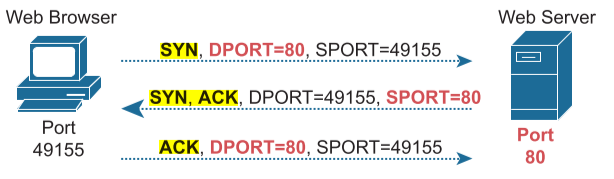
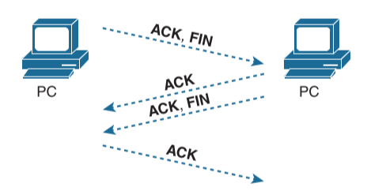

# Introduction to TCP/IP Transport and Applications
## TCP/IP Layer 4 Protocols: TCP and UDP
data-link protocols notice errors (a process called error detection) but then discard frames that have errors. TCP provides retransmission (error
recovery ) and helps to avoid congestion (flow control), whereas UDP does not.

TCP/IP Transport Layer Features:

- Multiplexing using ports
- Error recovery (reliability)
- Flow control using windowing
- Connection establishment and termination
- Ordered data transfer and data segmentation

### Transmission Control Protocol
TCP provides error recovery, but to do so, it consumes more bandwidth and uses more processing cycles. UDP does not perform error recovery,
but it takes less bandwidth and uses fewer processing cycles.

TCP Header Fields:

        <---------  4 Bytes  -------------->
        | Source Port   | Destination Port |
        |        Sequence Number           |
        |       Acknowledgement Number     |
        |Offs.|Res.|Flag|   Window         |
        |Checksum       |   Urgent         |

 TCP and UDP multiplexing tells the receiving computer to which application to give the received data.

Multiplexing relies on a concept called a socket. A socket consists of three things: 
- An IP address 
- A transport protocol
- A port number

IANA defines :
Well Known (System) Ports : 0 to 1023
User (Registered) Ports : 1024 to 49151
Ephemeral (Dynamic, Private) ports : 49152 to 65535

The combination of source and destination sockets allows all participating hosts to distinguish between the data’s source and destination. 

Popular Applications and Their Well-Known Port Numbers :
|Port|Protocol|Application|
|---|---|---|
|20|TCP|FTP Data|
|21|TCP|FTP control|
|22|TCP|SSH|
|23|TCP|Telnet|
|25|TCP|SMTP|
|53|UDP, TCP|DNS|
|67|UDP|DHCP Server|
|68|UDP|DHCP Client|
|69|UDP|TFTP|
|80|TCP|HTTP|
|110|TCP|POP3|
|161|UDP|SNMP|
|443|TCP|SSL|
|514|UDP|Syslog|

### Connection Establishment and Termination
 Connection establishment refers to the process of initializing Sequence and Acknowledgment fields and agreeing on the port numbers used.
 three-way connection establishment flow (also called a three-way handshake): 
 

 Connection Termination :
 

  four-way termination sequence is straightforward and uses an additional flag, called the FIN bit. (FIN is short for “finished,” as you might guess.) One interesting note: Before the device on the right sends the third TCP segment in the sequence, it notifies the application that the connection is coming down. It then waits on an acknowledgment from the application before sending the third segment in the figure. Just in case the application takes some time to reply, the PC on the right sends the second flow in the figure, acknowledging that the other PC wants to take down the connection. Otherwise, the PC on the left might resend the first segment repeatedly.

Connection-oriented protocol: A protocol that requires an exchange of messages before data transfer begins, or that has a required pre-established correlation between two endpoints.
■ Connectionless protocol: A protocol that does not require an exchange of messages and that does not require a pre-established correlation between two endpoints.

### Error Recovery and Reliability
TCP numbers data bytes using the Sequence and Acknowledgment fields in the TCP header. TCP achieves reliability in both directions, using the Sequence Number field of one direction combined with the Acknowledgment field in the opposite direction

acknowledging by listing the next expected byte, rather than the number of the last byte received, is called forward acknowledgment.)

TCP uses the Sequence and Acknowledgment fields so that the receiving host can notice lost data, ask the
sending host to resend, and then acknowledge that the re-sent data arrived.

 devices may wait a few moments to make sure no other acknowledgments arrive (using a timer called the retransmission timer)

 ### Flow Control Using Windowing
 TCP implements flow control by using a window concept that is applied to the amount of data that can be outstanding and awaiting acknowledgment at any one point in time. The window concept lets the receiving host tell the sender how much data it can receive right now, giving the receiving host a way to make the sending host slow down or speed up. The receiver can slide the window size up and down—called a sliding window or dynamic window—to change how much data the sending host can send.

if an acknowledgment is received before the window is exhausted, a new window begins, and the sender continues sending data until the current w indow is exhausted. Often times, in a network that has few problems, few lost segments, and little congestion, the TCP windows stay relatively large with hosts seldom waiting to send.
### User Datagram Protocol
UDP is connectionless and provides no reliability, no windowing, no reordering of the received data, and
no segmentation of large chunks of data into the right size for transmission. However, UDP provides some functions of TCP, such as data transfer and multiplexing using port numbers, and it does so with fewer bytes of overhead and less processing required than TCP.

UDP has only 8 bytes, in comparison to the 20-byte TCP header :

    <---------  4 Bytes  -------------->
    | Source Port   | Destination Port |    
    | Length        | Checksum         |
