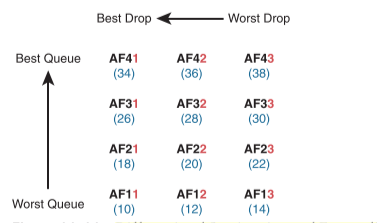

# Quality of Service (QoS)
QoS refers to the tools that networking devices use to apply some different treatment to packets in the network as they pass through the device.

 QoS tools give you the means to manage four characteristics of network traffic: 
* <b>Bandwidth</b> - speed of a link, in bits per second (bps).QoS tools determine what packet is sent over the link next, so the networking device is in control of which messages get access to the bandwidth next and how much of that bandwidth (capacity) each type of traffic gets over time.
* <b>Delay</b> - one-way delay or round-trip delay. One-way delay refers to the time between sending one packet and that same packet arriving at the destination host. Round-trip delay counts the one-way delay plus the time for the receiver of the first packet to send back a packet—in other words, the time it takes to send one packet between two hosts and receive one back. 
* <b>Jitter</b> - variation in one-way delay between consecutive packets sent by the same application
* <b>Loss</b> - number of lost messages, usually as a percentage of packets sent

Guidelines for interactive voice : 
* Delay (one-way): 150 ms or less 
* Jitter: 30 ms or less
* Loss: 1% or less

## Classification and Marking
The process of marking of packets and the definition of trust boundaries. Classifies packets based on their header contents, and then marks the message by changing some bits in specific header fields.

QoS tools are enabled on an interface. Also like ACLs, QoS tools are enabled for a direction: packets entering the interface (before the forwarding decision) or for messages exiting the interface (after the forwarding decision).

Routers use queuing tools to place some packets in one output queue, other packets in another, and so on, when the outgoing interface happens to be busy. Then, when the outgoing interface becomes available to send another message, the queuing tool’s scheduler algorithm can pick the next message from any one of the queues, prioritizing traffic based on the rules configured by
the network engineer

Work to match packets can even degrade device performance.  doing complex matching early in the life of a packet and then marking the packet. <b>Marking</b> means that the QoS tool changes one or more header fields, setting a value in the header's <i>Differentiated Services Code Point (DSCP)</i> field, a 6-bit field in the IP header meant for QoS marking.

###  Classification on Routers with ACLs and NBAR
Many QoS tools support the ability to simply refer to an IP ACL. For any packet matched by the ACL with a permit action, consider that packet a match for QoS, so do a particular QoS action.

Not every classification can be easily made by matching with an ACL. In more challenging cases, Cisco Network Based Application Recognition (NBAR) can be used. NBAR is basically in its second major version, called NBAR2, or next-generation NBAR. In short, NBAR2 matches packets for classification in a large variety of ways that are very useful for QoS. NBAR provides easy built-in matching ability for more than 1000 different subcategories of applications. NBAR refers to this idea of defining the characteristics of different applications as application signatures.

    R1#(config)# class-map matchingexample 
    R1(config-cmap)# match protocol attribute category voice-and-video ? 
    ! output heavily edited for length amazon-instant-video    VOD service by Amazon
    cisco-ip-camera         Cisco video surveillance camera

### Marking IP DSCP and Ethernet CoS
Marking a QoS field in the IP header works well with QoS because the IP header exists for the entire trip from the source host to the destination host.

IPv4 defines a Type of Service (ToS) byte (8 bits) in the IPv4 header. The original RFC defined a 3-bit IP Precedence (IPP) field for QoS marking.

While a great idea, IPP gave us only eight different values to mark, so later RFCs redefined the ToS byte with the DSCP field. 

DSCP increased the number of marking bits to 6 bits, allowing for 64 unique values that can be marked. The DiffServ RFCs have become accepted as the most common method to use when doing QoS, and using the DSCP field for marking has become quite common.

IPv6 has a similar field to mark as well. The 6-bit field also goes by the name DSCP, with the byte in the IPv6 header being called the IPv6 Traffic Class byte.

Another useful marking field exists in the 802.1Q header. This field sits in the third byte of the 4-byte 802.1Q header, as a 3-bit field, supplying eight possible values to mark. It goes by two different names: Class of Service, or CoS, and Priority Code Point, or PCP.

    802.1Q header is not included in all Ethernet frames. The 802.1Q header only exists when 802.1Q trunking is used on a link. As a result, QoS tools can make use of the CoS field only for QoS features enabled on interfaces that use trunking

|Field Name|Header|Length(bits)|Used in|
|--|--|--|--|
|DSCP|IPv4, IPv6|6|End-to-end packet|
|IPP|IPv4, IPv6|3|End-to-end packet|
|CoS|802.1Q|3|Over VLAN trunk|
|TID|802.11|3|Over Wi-Fi|
|EXP|MPLS Label|3|Over MPLS WAN|

### Defining Trust Boundaries
Anything the end user controls might be used inappropriately at times. For instance, a PC user could know enough about DiffServ and DSCPs to know that most voice traffic is marked with a DSCP called Expedited Forwarding (EF), which has a decimal value of 46. Voice traffic gets great QoS treatment, so PC users could mark all their traffic as DSCP 46, hoping to get great QoS treatment.

Trust boundary refers to the point in the path of a packet flowing through the network at which the networking devices can trust the current QoS markings. That boundary typically sits in a device under the control of the IT staff.

When the access layer includes an IP Phone, the phone is typically the trust boundary, instead of the access layer switch. IP Phones can set the CoS and DSCP fields of the messages created by the phone, as well as those forwarded from the PC through the phone.

### DiffServ Suggested Marking Values

#### Expedited Forwarding (EF) 

DiffServ defines the Expedited Forwarding (EF) DSCP value—a single value—as suggested for use for packets that need low latency (delay), low jitter, and low loss. The Expedited Forwarding RFC defines the specific DSCP value (decimal 46) and an equivalent text name (Expedited Forwarding). QoS configuration commands allow the use of the decimal value or text name, but one purpose of having a text acronym to use is to make the value more memorable, so many QoS configurations refer to the text names.

Most often QoS plans use EF to mark voice payload packets. With voice calls, some packets carry voice payload, and other packets carry call signaling messages. Call signaling messages set up (create) the voice call between two devices, and they do not require low delay, jitter, and loss. Voice payload packets carry the digitized voice and these packets do need better QoS. By default, Cisco IP Phones mark voice payload with EF, and mark voice signaling packets sent by the phone with another value called CS3.

#### Assured Forwarding (AF) 

The Assured Forwarding (AF) DiffServ RFC defines a set of 12 DSCP values meant to be used in concert with each other. 

First, it defines the concept of four separate queues in a queuing system. Additionally, it defines three levels of drop priority within each queue for use with congestion avoidance tools. With four queues, and three drop priority classes per queue, you need 12 different DSCP markings, one for each combination of queue and drop priority. 

Assured Forwarding defines the specific AF DSCP text names and equivalent decimal values as listed . The text names follow a format of AFXY, with X referring to the queue (1 through 4) and Y referring to the drop priority (1 through 3).

 

Inside the queue with all the AF2y traffic, you would treat the AF21, AF22, and AF23 each differently in regard to drop actions (congestion avoidance), with AF21 getting the preferred treatment and AF23 the worst treatment.

#### Class Selector (CS) 

Originally, the ToS byte was defined with a 3-bit IP Precedence (IPP) field. When DiffServ redefined the ToS byte, it made sense to create eight DSCP values for backward compatibility with IPP values. The Class Selector (CS) DSCP values are those settings. Basically, the DSCP values have the same first 3 bits as the IPP field, and with binary 0s for the last 3 bits, as shown on the left side of the figure. CSx represents the text names, where x is the matching IPP value (0 through 7).

#### Guidelines for DSCP Marking Values

Having different uses of different DSCP values by different devices in the same enterprise would make deploying QoS quite difficult at best.

Cisco QoS Design Guides:
- DSCP EF: Voice payload 
- AF4x: Interactive video (for example, videoconferencing) 
- AF3x: Streaming video 
- AF2x: High priority (low latency) data
- CS0: Standard data

## Queuing
Describes the scheduling of packets to give one type of packet priority over another. Sometimes the outgoing interface is busy, so the device keeps the outgoing message in a queue, waiting for the outgoing interface to be
available. At the same time, the router may take a variety of other actions as well—ingress ACL, ingress NAT (on the inside interface), egress ACLs after the forwarding decision is made, and so on.

The queuing system may use a single output queue, with a first-in, first-out (FIFO) scheduler.

Most networking devices can have a queuing system with multiple queues. To use multiple queues, the queuing system needs a classifier function to choose which packets are placed into which queue. (The classifier can react to previously marked values or do a more extensive match.) The queuing system needs a scheduler as well, to decide which message to take next when the interface becomes available. 

The scheduler can be the most interesting part because it can perform prioritization. Prioritization refers to the concept of giving priority to one queue over another in some way.

### Round-Robin Scheduling (Prioritization) 
Round-Robin cycles through the queues in order, taking turns with each queue.

Round-robin scheduling also includes the concept of weighting (generally called weighted round robin). Basically, the scheduler takes a different number of packets (or bytes) from each queue, giving more preference to one queue over another.

For example, routers use a popular tool called Class-Based Weighted Fair Queuing (CBWFQ) to guarantee a minimum amount of bandwidth to each class. That is, each class receives at least the amount of bandwidth configured during times of congestion, but maybe more. Internally, CBWFQ uses a weighted round-robin scheduling algorithm, while letting the network engineer define the weightings as a percentage of link bandwidth. 

If the outgoing link is congested, the scheduler guarantees the percentage bandwidth shown in the figure to each queue.

For audio, Round-Robin is not an acceptable solution since it may add too much delay and jitter.  

LLQ, tells the scheduler to treat one or more queues as special priority queues. The LLQ scheduler always takes the next message from one of these special priority queues. The queue never has time to fill up, so there are no drops due to the queue filling up. Using LLQ, or a priority queue, provides the needed low delay, jitter, and loss for the traffic in that queue.

But the scheduler never services the other queues (called queue starvation). The solutio for this is to limit the amount of traffic placed into the priority queue, using a feature called policing, putting a cap on the bandwidth used by the priority queue.

#### A Prioritization Strategy for Data, Voice, and Video

1. Use a round-robin queuing method like CBWFQ for data classes and for noninteractive voice and video.
2. If faced with too little bandwidth compared to the typical amount of traffic, give data classes that support business-critical applications much more guaranteed bandwidth than is given to less important data classes.
3. Use a priority queue with LLQ scheduling for interactive voice and video, to achieve low delay, jitter, and loss.
4. Put voice in a separate queue from video so that the policing function applies separately to each.
5. Define enough bandwidth for each priority queue so that the built-in policer should not discard any messages from the priority queues.
6. Use Call Admission Control (CAC) tools to avoid adding too much voice or video to the network, which would trigger the policer function.

### Shaping and Policing
They are often used on opposite ends of a link. These tools have a more specialized use and are not found in as many locations in a typical enterprise, usually at the WAN edge. 

Both policing and shaping monitor the bit rate of the combined messages that flow through a device. Once enabled, the policer or shaper notes each packet that passes and measures the number of bits per second over time. Both attempt to keep the bit rate at or below the configured speed, but by using two different actions: policers discard packets, and shapers hold packets in queues to delay the packets.
Shapers and policers monitor the traffic rate (the bits per second that move through the shaper or policer) versus a configured shaping rate or policing rate.

#### Policing
Discards or re-marks messages that exceed the policing rate

Traffic arrives at networking devices at a varying rate, with valleys and spikes. The policer has some awareness of the measured bit rate over time, which can be compared to the configured rate. In effect, the policer chops off the top of the graph at the policing rate.

Policers allow for a burst beyond the policing rate for a short time, after a period of low activity. So, that one peak that exceeds the policing rate allows for the nature of bursty data applications.

Policing makes sense only in certain cases, and as a general tool, it can be best used at the edge between two networks.

The SP may use policing to protect all customers from the negative effects of the customers who send too much traffic.

    Policers can discard excess traffic, but they can also re-mark packets.

1. Re-mark packets that exceed the policing rate, but let them into the SP’s network. 
2. If other SP network devices are experiencing congestion when they process the packet, the different marking means that device can discard the packet. However…
3. …if no other SP network devices are experiencing congestion when forwarding that re-marked packet, it gets through the SP network anyway. 

Summarizing the key features of policing: 
- It measures the traffic rate over time for comparison to the configured policing rate. 
- It allows for a burst of data after a period of inactivity. 
- It is enabled on an interface, in either direction, but typically at ingress. 
- It can discard excess messages but can also re-mark the message so that it is a candidate for more aggressive discard later in its journey.

#### Shaping
Slows down messages that exceed the shaping rate.

The SP has told you that it always discards incoming traffic that exceeds the CIR, so use a shaper to slow down the traffic. Shaping before sending data to an SP that is policing—is one of the typical uses of a shaper. Shapers can be useful in other cases as well, but generally speaking, shapers make sense when a device can send at a certain speed, but there is a benefit to slowing down the rate.

The shaper slows messages down by queuing the messages. The shaper then services the shaping queues, but not based on when the physical interface is available but based on the shaping rate.

Because shapers create queues where messages wait, you should apply a queuing tool to those queues. It is perfectly normal to apply the round-robin and priority queuing features of CBWFQ and LLQ.

The unfortunate side effect of a shaper is that it slows down packets, which then creates more delay and probably more jitter. The delay occurs in part because of the message simply waiting in a queue, but partly because of the mechanisms used by a shaper. Thankfully, you can (and should) configure a shaper’s setting that changes the internal operation of the shaper, which then reduces the delay and jitter caused to voice and video traffic.

A shaper’s time interval refers to its internal logic and how a shaper averages, over time, sending at a particular rate. A shaper basically sends as fast as it can and then waits. To support for voice and video packets, the time interval should be configured short, a 10-ms time interval to support voice and video. 

Summarizing the key features of shapers: 
- Shapers measure the traffic rate over time for comparison to the configured shaping rate. 
- Shapers allow for bursting after a period of inactivity. 
- Shapers are enabled on an interface for egress (outgoing packets). 
- Shapers slow down packets by queuing them and over time releasing them from the queue at the shaping rate.
- Shapers use queuing tools to create and schedule the shaping queues, which is very important for the same reasons discussed for output queuing.

## Congestion Avoidance
Addresses how to manage the packet loss that occurs when network devices get too busy. It attempts to reduce overall packet loss by preemptively discarding some packets used in TCP connections.

### TCP Windowing

TCP uses a flow control mechanism called windowing. Each TCP receiver grants a window to the sender. The window, which is a number, defines the number of bytes the sender can send over the TCP connection before receiving a TCP acknowledgment for at least some of those bytes. More exactly, the window size is the number of unacknowledged bytes that the sender can send before the sender must simply stop and wait.

The TCP window mechanism gives the receiver control of the sender’s rate of sending data. Each new segment sent by the receiver back to the sender grants a new window, which can be smaller or larger than the previous window. By raising and lowering the window, the receiver can make the sender wait more or wait less.

By choice, when all is well, the receiver keeps increasing the granted window, doubling it every time the receiver acknowledges data. Eventually, the window grows to the point that the sender never has to stop sending: the sender keeps receiving TCP acknowledgments before sending all the data in the previous window. Each new acknowledgment (as listed in a TCP segment and TCP header) grants a new window to the sender.

Also by choice, when a TCP receiver senses the loss of a TCP segment, he shrinks the window with the next window size listed in the next TCP segment the receiver sends back to the sender. For each TCP segment lost, the window can shrink by one-half, with multiple segment losses causing the window to shrink by half multiple times, slowing down the sender’s rate significantly.

tail drop : new packets that arrive on the queue right now will be dropped because there is no room at the tail of the queue (tail drop).

### Congestion Avoidance Tools
Congestion avoidance tools attempt to avoid the congestion, primarily through using TCP’s own windowing mechanisms. These tools discard some TCP segments before the queues fill, hoping that enough TCP connections will slow down, reducing congestion, and avoiding a much worse problem: the effects of many more packets being dropped due to tail drop. 

    Discard some packets now in hopes that the device discards far fewer in the long term. 

Congestion avoidance tools monitor the average queue depth over time, triggering more severe actions the deeper the queue. 

 When the queue depth is low, below the minimum threshold values, the congestion avoidance tool does nothing. When the queue depth is between the minimum and maximum thresholds, the congestion avoidance tool discards a percentage of the packets—usually a small percentage, like 5, 10, or 20 percent. If the queue depth passes the maximum threshold, the tool drops all packets, in an action called full drop.

Congestion avoidance tools can classify messages to treat some packets better than others. In the same queue, packets with one marking might be dropped more aggressively, and those with better DSCP markings dropped less aggressively.