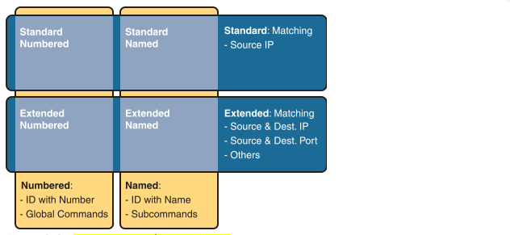

# Basic IPv4 Access Control Lists
## IPv4 Access Control List Basics
### ACL Location and Direction
routers can apply ACL logic to packets at the point at which the IP packets enter an interface, or the point at which they exit an interface. In other words, the ACL becomes associated with an interface and for a direction of packet flow (either in or out). That is, the ACL can be applied inbound to the router, before the router makes its forwarding (routing) decision, or outbound, after the router makes its forwarding decision and has determined
the exit interface to use.

ACL looks for header fields you should already know well, including the source and destination IP addresses, plus TCP and UDP port numbers.

The configuration commands use the keywords deny and permit.

### Types of ACL
Features :
- Standard numbered ACLs (1–99)
- Extended numbered ACLs (100–199)
- Additional ACL numbers (1300–1999 standard, 2000–2699 extended)
- Named ACLs
- Improved editing with sequence numbers

IP ACLs will be either numbered or named in that the configuration identifies the ACL either using a number or a name. ACLs will also be either standard or extended, with extended ACLs having much more robust abilities in matching packets. 
 Connection Termination :
 

## Standard Numbered IPv4 ACLs

matches only the source IP address of the packet (standard), is configured to identify the ACL using
numbers rather than names (numbered), and looks at IPv4 packets.

ACLs use first-match logic.
if a packet does not match any of the items in the ACL, the packet is discarded. The reason is that every IP ACL has a deny all statement implied at the end of the ACL. It does not exist in the configuration, but if a router keeps searching the list, and no match is made by the end of the list, IOS considers the packet to have matched an entry that has a deny action.
<code>access-list {1-99 | 1300-1999} {permit | deny} matching-parameters</code>

Each standard numbered ACL has one or more access-list commands with the same number, any number from the ranges shown in the preceding line of syntax. (One number is no better than the other.) IOS refers to each line in an ACL as an Access Control Entry (ACE), but many engineers just call them ACL statements.

#### Matching the Exact IP Address
<code>access-list 1 permit 10.1.1.1</code> 
<code>access-list 1 permit host 10.1.1.1</code> for older IOS versions.

#### Matching a Subset of the Address with Wildcards
Decimal 0: The router must compare this octet as normal. 
Decimal 255: The router ignores this octet, considering it to already match.

when using a WC mask, the access-list command’s loosely defined source parameter should be a 0 in any octets where the WC mask is a 255. IOS will specify a source address to be 0 for the parts that will be ignored, even if nonzero values were
configured. 

<code>access-list 1 permit 172.16.8.0 0.0.3.255</code>

#### Matching Any/All Addresses
<code>access-list 1 permit any</code>

You might also want to explicitly configure a command to deny all traffic (for example, access-list 1 deny any) at the end of an ACL. Why, when the same logic already sits at the end of the ACL anyway? Well, the ACL show commands list counters for the number of packets matched by each command in the ACL, but there is no counter for that implicit deny
any concept at the end of the ACL.

### Implementing Standard IP ACLs
<code>access-list access-list-number {deny | permit} source [source-wildcard]</code>

1. Plan the location (router and interface) and direction (in or out) on that interface: 
    - Standard ACLs should be placed near to the destination of the packets so that they do not unintentionally discard packets that should not be discarded.
    - Because standard ACLs can only match a packet’s source IP address, identify the source IP addresses of packets as they go in the direction that the ACL is examining.
2. Configure one or more access-list global configuration commands to create the ACL, keeping the following in mind: 
    - The list is searched sequentially, using first-match logic. 
    - The default action, if a packet does not match any of the access-list commands, is to deny (discard) the packet.
3. Enable the ACL on the chosen router interface, in the correct direction, using the ip access-group number {in | out} interface subcommand .

<code>show ip access-lists</code> command lists details about IPv4 ACLs only, while the <code>show access-lists</code> command lists details about IPv4 ACLs plus any other types of ACLs that are currently
configured; for example, IPv6 ACLs .

<code>show ip interface</code> command output. This command lists, among many other items, the number or name of any IP ACL enabled on the interface per the ip access-group interface subcommand.

a router does not filter packets that the router itself creates with an outbound ACL. Examples of those packets include routing protocol messages and packets sent by the ping and traceroute commands on that router.

### Troubleshooting and Verification Tips Troubleshooting IPv4 ACLs requires some attention

if you add the log keyword to the end of an access-list command, IOS then issues log messages with occasional statistics about matches of that particular line of
the ACL.

### Reverse Engineering from ACL to Address Range
with the command access-list 1 permit 172.16.200.0 0.0.7.255, the low end of the range is simply 172.16.200.0, taken directly from the command itself. Then, to find the high end of the range, just add this number to the WC mask, as follows: 172.16.200.0 + 0. 0. 7.255 = 172.16.207.255

IOS lets the CLI user type an access-list command in configuration mode, and IOS will potentially change the address parameter before placing the command into the running-config file.

with a wildcard mask of 0.0.255.255, IOS ignores the last two octets. IOS expects the address field to end with two 0s. If not, IOS still accepts the access-list command, but IOS changes the last two octets of
the address to 0s.

IOS allows WC masks that interleave 0s and 1s, but using these WC masks breaks the simple method of calculating
the range of addresses. 